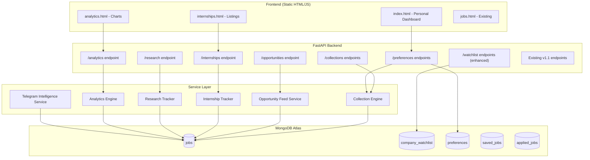

# Design Document: Career Opportunity Radar

## Overview

Career Opportunity Radar upgrades JobCopilot from v1.1.0 to v1.2.0, transforming it from a job aggregation tool into an intelligent career opportunity discovery system. The design adds five new backend service modules (Collection Engine, Opportunity Feed, Internship Tracker, Research Tracker, Analytics Engine), enhances the Telegram notifier with intelligence summaries, introduces a tiered watchlist and personal dashboard preferences, and delivers two new frontend pages (analytics.html, internships.html).

All new functionality is built on top of the existing FastAPI + PyMongo + static HTML architecture. Jobs are classified into collections at query time using MongoDB aggregation pipelines — no data duplication. The system remains within Render free-tier (512MB RAM, single web service + cron) and MongoDB Atlas free-tier (512MB storage) constraints.

### Key Design Decisions

1. **Query-time classification over materialized collections** — Collections are computed via MongoDB regex queries at request time rather than storing collection membership. This avoids storage overhead and keeps data consistent without background sync jobs.

2. **Service modules as plain Python classes** — New services follow the existing pattern (e.g., `TelegramNotifier`, `FilterEngine`) as stateless classes instantiated per-request or at startup. No dependency injection framework is introduced.

3. **MongoDB aggregation pipelines for analytics** — All analytics are computed on-the-fly using `$group`, `$sort`, and `$limit` stages. No caching or materialized views are used, keeping storage within free-tier limits.

4. **Static HTML frontend with Chart.js CDN** — New pages follow the existing pattern of standalone HTML files fetching data from the API. No build step or bundler is required.

5. **Backward-compatible API extension** — All new endpoints are additive. Existing v1.1 endpoints remain unchanged in request/response format.

## Architecture



### Request Flow

1. Frontend pages make fetch() calls to the FastAPI backend
2. API route handlers instantiate the appropriate service class
3. Services build MongoDB queries/aggregation pipelines and execute them
4. Results are serialized to JSON and returned to the frontend
5. The daily scraper triggers the Telegram Intelligence Service after completing its scrape cycle

## Components and Interfaces

### 1. Collection Engine (`app/services/collection_engine.py`)

Responsible for defining collections and classifying jobs at query time.

```python
@dataclass
class CollectionDefinition:
    name: str
    keywords: list[str]

class CollectionEngine:
    COLLECTIONS: list[CollectionDefinition]  # Predefined set of 11 collections

    def get_all_collections(self) -> list[dict]:
        """Return all collection names with job counts."""

    def get_collection(self, name: str) -> dict | None:
        """Return collection metadata (name, keywords, count) or None."""

    def get_collection_jobs(self, name: str, page: int, page_size: int) -> PaginatedResult:
        """Return paginated jobs matching collection keywords."""

    def _build_collection_query(self, keywords: list[str]) -> dict:
        """Build a MongoDB $or query with case-insensitive regex for title and description."""
```

### 2. Opportunity Feed Service (`app/services/opportunity_feed.py`)

Aggregates categorized top opportunities into a single response.

```python
class OpportunityFeedService:
    def get_feed(self) -> dict:
        """Return dict with keys: top_companies, new_companies, remote_jobs,
        internships, research_roles, healthcare_roles. Each limited to 10 entries."""

    def _get_top_companies(self) -> list[dict]:
        """Aggregate companies by job count, return top 10."""

    def _get_new_companies(self) -> list[dict]:
        """Find companies first seen in last 7 days."""

    def _get_remote_jobs(self) -> list[dict]:
        """Query jobs with 'remote' in location field."""

    def _get_internships(self) -> list[dict]:
        """Query jobs matching internship keywords in title."""

    def _get_research_roles(self) -> list[dict]:
        """Query jobs from research institutions."""

    def _get_healthcare_roles(self) -> list[dict]:
        """Query jobs matching healthcare/medtech collection keywords."""
```

### 3. Internship Tracker (`app/services/internship_tracker.py`)

Filters and retrieves internship-type positions.

```python
INTERNSHIP_KEYWORDS: list[str]  # 15 predefined keywords

class InternshipTracker:
    def get_internships(self, keyword: str | None, page: int, page_size: int) -> PaginatedResult:
        """Return paginated internships, optionally filtered by specific keyword."""

    def _build_internship_query(self, keyword: str | None) -> dict:
        """Build regex $or query matching any internship keyword in title."""
```

### 4. Research Tracker (`app/services/research_tracker.py`)

Filters jobs from predefined Indian research institutions.

```python
RESEARCH_INSTITUTIONS: list[str]  # 13 predefined institutions

class ResearchTracker:
    def get_research_jobs(self, institution: str | None, page: int, page_size: int) -> PaginatedResult:
        """Return paginated research jobs, optionally filtered by institution."""

    def get_recent_research(self, limit: int = 10) -> list[JobRecord]:
        """Return most recent research opportunities."""

    def _build_research_query(self, institution: str | None) -> dict:
        """Build regex $or query matching institution names in company or description."""
```

### 5. Analytics Engine (`app/services/analytics_engine.py`)

Computes aggregate statistics using MongoDB aggregation pipelines.

```python
class AnalyticsEngine:
    def compute_analytics(self) -> dict:
        """Return all analytics metrics in a single dict."""

    def _jobs_per_day(self) -> list[dict]:
        """Aggregate job counts by date_posted for last 30 days."""

    def _jobs_per_company(self) -> list[dict]:
        """Aggregate top 20 companies by job count."""

    def _jobs_per_source(self) -> list[dict]:
        """Aggregate all sources by job count."""

    def _jobs_per_platform(self) -> list[dict]:
        """Aggregate all ATS platforms by job count."""

    def _jobs_per_location(self) -> list[dict]:
        """Aggregate top 20 locations by job count."""

    def _jobs_per_collection(self) -> list[dict]:
        """Compute job count for each collection using CollectionEngine."""

    def _internship_vs_fulltime(self) -> dict:
        """Count internship vs non-internship jobs."""

    def _research_vs_industry(self) -> dict:
        """Count research institution vs other jobs."""
```

### 6. Telegram Intelligence Service (enhancement to `app/services/notifier.py`)

Extends the existing `TelegramNotifier` with a daily intelligence summary method.

```python
class TelegramNotifier:
    # ... existing methods unchanged ...

    def send_intelligence_summary(self, jobs: list[JobRecord], watchlist: list[dict]) -> None:
        """Send categorized daily intelligence summary.
        Sections: Top 10 jobs, Top internships (5), Top research (5),
        Watchlist companies hiring, New ATS opportunities (5).
        Prioritizes Tier 1 watchlist companies first."""
```

### 7. Collections API (`app/api/collections.py`)

```
GET /collections              → List all collections with counts
GET /collections/{name}       → Collection metadata (name, keywords, count)
GET /collections/{name}/jobs  → Paginated jobs in collection
```

### 8. Opportunities API (`app/api/opportunities.py`)

```
GET /opportunities → Categorized feed (6 categories, max 10 each)
```

### 9. Internships API (`app/api/internships.py`)

```
GET /internships?keyword=...&page=1&page_size=50 → Paginated internship listings
```

### 10. Research API (`app/api/research.py`)

```
GET /research?institution=...&page=1&page_size=50 → Paginated research jobs
GET /research/recent                              → 10 most recent research jobs
```

### 11. Analytics API (`app/api/analytics.py`)

```
GET /analytics → All computed metrics
```

### 12. Preferences API (`app/api/preferences.py`)

```
POST /preferences/pinned-collections   → Pin a collection (max 5)
POST /preferences/pinned-companies     → Pin a company (max 10)
GET  /preferences/dashboard            → Personal dashboard data
DELETE /preferences/pinned-collections/{name} → Unpin a collection
DELETE /preferences/pinned-companies/{name}   → Unpin a company
```

### 13. Enhanced Watchlist API (modification to `app/api/watchlist.py`)

```
PATCH /watchlist/{company} → Update tier (tier1/tier2/tier3)
```

Existing endpoints unchanged; response now includes `tier` field.

## Data Models

### New Pydantic Response Models (`app/models/schemas.py` additions)

```python
class CollectionSummary(BaseModel):
    name: str
    job_count: int

class CollectionDetail(BaseModel):
    name: str
    keywords: list[str]
    job_count: int

class OpportunityFeedResponse(BaseModel):
    top_companies: list[dict]
    new_companies: list[dict]
    remote_jobs: list[JobResponse]
    internships: list[JobResponse]
    research_roles: list[JobResponse]
    healthcare_roles: list[JobResponse]

class AnalyticsResponse(BaseModel):
    jobs_per_day: list[dict]
    jobs_per_company: list[dict]
    jobs_per_source: list[dict]
    jobs_per_platform: list[dict]
    jobs_per_location: list[dict]
    jobs_per_collection: list[dict]
    top_hiring_companies: list[dict]
    top_locations: list[dict]
    top_ats_platforms: list[dict]
    internship_vs_fulltime: dict
    research_vs_industry: dict

class PersonalDashboardResponse(BaseModel):
    pinned_company_jobs: list[JobResponse]
    pinned_collection_jobs: list[JobResponse]
    new_research_opportunities: list[JobResponse]
```

### MongoDB Document Schemas

**preferences collection:**
```json
{
  "_id": ObjectId,
  "type": "pinned_collections" | "pinned_companies",
  "items": ["collection_name_1", "collection_name_2"]
}
```

**company_watchlist collection (enhanced):**
```json
{
  "_id": ObjectId,
  "company_name": "Philips",
  "ats_platform": "workday",
  "tier": "tier1"  // NEW FIELD - defaults to "tier3"
}
```

### Collection Definitions (in-code configuration)

```python
COLLECTIONS = [
    CollectionDefinition("Medical Technology", ["medical technology", "medtech", "medical device", "clinical engineering"]),
    CollectionDefinition("Biomedical Engineering", ["biomedical", "biomed", "bioengineering", "biomechanics"]),
    CollectionDefinition("Healthcare Technology", ["healthtech", "health tech", "healthcare technology", "digital health", "telemedicine"]),
    CollectionDefinition("Medical Devices", ["medical device", "surgical instrument", "diagnostic equipment", "implant"]),
    CollectionDefinition("Research Engineering", ["research engineer", "R&D engineer", "research scientist", "research associate"]),
    CollectionDefinition("Embedded Systems", ["embedded", "firmware", "RTOS", "microcontroller", "ARM"]),
    CollectionDefinition("IoT", ["IoT", "internet of things", "connected devices", "smart devices", "edge computing"]),
    CollectionDefinition("Python Development", ["python", "django", "flask", "fastapi", "pandas"]),
    CollectionDefinition("Product Management", ["product manager", "product owner", "product management", "product strategy"]),
    CollectionDefinition("Healthcare AI", ["healthcare AI", "medical AI", "clinical AI", "health informatics", "medical imaging AI"]),
    CollectionDefinition("Diagnostics and Biosensors", ["diagnostics", "biosensor", "point-of-care", "lateral flow", "PCR", "immunoassay"]),
]
```

### Internship Keywords (in-code configuration)

```python
INTERNSHIP_KEYWORDS = [
    "Internship", "Trainee", "Graduate Engineer", "Research Intern",
    "Project Associate", "Project Assistant", "JRF", "SRF", "RA",
    "Summer Internship", "Industrial Trainee", "Associate Engineer",
    "Graduate Trainee", "Young Professional", "Project Engineer",
]
```

### Research Institutions (in-code configuration)

```python
RESEARCH_INSTITUTIONS = [
    "IISc", "DRDO", "C-DAC", "AIIMS", "IITs", "CSIR Labs",
    "ISRO", "BARC", "THSTI", "NIBMG", "ICMR", "NIMHANS", "SCTIMST",
]
```

## Correctness Properties

*A property is a characteristic or behavior that should hold true across all valid executions of a system — essentially, a formal statement about what the system should do. Properties serve as the bridge between human-readable specifications and machine-verifiable correctness guarantees.*

### Property 1: Collection keyword classification is correct and complete

*For any* job record with any title and description content, the Collection Engine SHALL classify the job into exactly those collections whose keywords appear (case-insensitive) in the job's title or description fields. A job matching keywords from N collections must appear in all N collections, and a job matching no keywords must appear in no collections.

**Validates: Requirements 1.2, 1.4**

### Property 2: Paginated results are sorted descending by date_posted

*For any* paginated API response from /collections/{name}/jobs, /internships, or /research endpoints, the returned jobs list SHALL be ordered such that each job's date_posted is greater than or equal to the next job's date_posted in the list.

**Validates: Requirements 2.3, 4.2, 5.2**

### Property 3: Filtered queries return only matching results

*For any* query to the filtering endpoints:
- /opportunities remote_jobs: all returned jobs SHALL have "remote" (case-insensitive) in their location field
- /internships: all returned jobs SHALL have at least one Internship_Keyword (case-insensitive) in their title field
- /research: all returned jobs SHALL have at least one Research_Institution name (case-insensitive) in their company or description field
- /internships?keyword=X: all returned jobs SHALL have keyword X in their title
- /research?institution=X: all returned jobs SHALL have institution X in their company or description

**Validates: Requirements 3.4, 3.5, 3.6, 4.1, 4.3, 5.1, 5.4**

### Property 4: New companies are first-seen within 7 days

*For any* set of jobs in the database, the new_companies category in the opportunity feed SHALL only contain companies whose earliest date_posted in the entire jobs collection falls within the last 7 days.

**Validates: Requirements 3.3**

### Property 5: Opportunity feed and recent research enforce maximum entry limits

*For any* dataset size, each category in the /opportunities response SHALL contain at most 10 entries, and /research/recent SHALL return at most 10 entries.

**Validates: Requirements 3.8, 5.3**

### Property 6: Top-N aggregations are correctly ordered by count

*For any* set of jobs, the top_hiring_companies (top 10), top_locations (top 10), and top_ats_platforms (all) analytics metrics SHALL be ordered by descending job count, and no company/location/platform outside the top-N list SHALL have a higher count than any entry in the list.

**Validates: Requirements 6.2, 6.3, 6.4**

### Property 7: Partition metrics sum to total job count

*For any* set of jobs, the internship_vs_fulltime metric's internship_count + fulltime_count SHALL equal the total number of jobs, and the research_vs_industry metric's research_count + industry_count SHALL equal the total number of jobs.

**Validates: Requirements 6.6, 6.7**

### Property 8: Intelligence summary contains all required sections with formatted job details

*For any* non-empty set of jobs and watchlist entries, the formatted intelligence summary SHALL contain section headers for all 5 categories (Top jobs, Internships, Research, Watchlist, ATS), and for each job included in the summary, the output SHALL contain the job's title, company, location, and URL.

**Validates: Requirements 8.2, 8.3**

### Property 9: Message splitting respects Telegram character limit

*For any* intelligence summary content of any length, when split into messages, each individual message SHALL be at most 4096 characters, and the concatenation of all split messages SHALL contain all the content from the original summary (no data loss).

**Validates: Requirements 8.5**

### Property 10: Tier 1 watchlist companies appear first in intelligence summary

*For any* watchlist containing companies across multiple tiers, the intelligence summary's watchlist section SHALL list all Tier 1 companies before any Tier 2 companies, and all Tier 2 companies before any Tier 3 companies.

**Validates: Requirements 9.6**

### Property 11: Personal dashboard returns only jobs matching pinned preferences

*For any* set of pinned collections, pinned companies, and jobs in the database, the /preferences/dashboard response SHALL only include jobs that either: (a) are from a pinned company, (b) match a pinned collection's keywords, or (c) are research opportunities from the last 7 days. No job outside these criteria SHALL appear in the response.

**Validates: Requirements 12.3**

### Property 12: Pinned preferences enforce maximum limits

*For any* sequence of pin operations, the system SHALL never store more than 5 pinned collections or more than 10 pinned companies. Attempts to exceed these limits SHALL be rejected without modifying the existing pinned items.

**Validates: Requirements 12.6, 12.7**

## Error Handling

### API Error Responses

| Scenario | HTTP Status | Response Body |
|----------|-------------|---------------|
| Collection not found | 404 | `{"detail": "Collection '{name}' not found"}` |
| Invalid tier value on PATCH | 422 | `{"detail": "Tier must be one of: tier1, tier2, tier3"}` |
| Pinned collections limit exceeded | 409 | `{"detail": "Maximum 5 pinned collections allowed"}` |
| Pinned companies limit exceeded | 409 | `{"detail": "Maximum 10 pinned companies allowed"}` |
| MongoDB connection failure | 500 | `{"detail": "Internal server error"}` |
| Analytics computation timeout | 500 | `{"detail": "Analytics computation timed out"}` |
| Invalid page/page_size params | 422 | FastAPI automatic validation error |

### Service-Level Error Handling

- **Collection Engine**: Returns empty results if MongoDB query fails; logs error. Never raises to caller.
- **Analytics Engine**: Each metric computation is independent. If one fails, others still return. Failed metrics return empty lists/dicts with error logged.
- **Telegram Intelligence Service**: Follows existing pattern — if credentials missing, skip silently. If API call fails, retry 3 times with exponential backoff, then log error and continue.
- **Opportunity Feed**: Each category is computed independently. If one category fails, it returns an empty list while others succeed.

### Frontend Error Handling

- **analytics.html**: Shows "Unable to load analytics data. Please try again later." with a retry button if /analytics returns an error.
- **internships.html**: Shows "No internships found" for empty results, "Failed to load internships" for errors.
- **index.html (personal dashboard)**: Gracefully hides pinned sections if /preferences/dashboard fails, showing only existing v1.1 content.

## Testing Strategy

### Property-Based Testing (Hypothesis)

The project already uses `hypothesis` (listed in requirements.txt) for property-based testing. Each correctness property above maps to one or more property-based tests.

**Configuration:**
- Library: `hypothesis` (already installed)
- Minimum iterations: 100 per property (`@settings(max_examples=100)`)
- Each test tagged with: `# Feature: career-opportunity-radar, Property {N}: {title}`

**Test file structure:**
```
backend/tests/
├── test_collection_engine.py          # Properties 1, 2
├── test_opportunity_feed.py           # Properties 3, 4, 5
├── test_internship_tracker.py         # Properties 2, 3
├── test_research_tracker.py           # Properties 2, 3, 5
├── test_analytics_engine.py           # Properties 6, 7
├── test_telegram_intelligence.py      # Properties 8, 9, 10
├── test_preferences.py                # Properties 11, 12
```

**Generator Strategy:**
- Custom Hypothesis strategies for `JobRecord` generation with controlled keyword/institution embedding
- Strategies for generating watchlist entries with mixed tiers
- Date strategies for testing time-based filters (last 7 days, last 30 days)

### Unit Tests (pytest)

Example-based tests for:
- API endpoint response structure validation
- 404 for non-existent collections
- Default parameter values (page=1, page_size=50)
- Tier defaulting to "tier3"
- Telegram credential absence handling
- Frontend HTML structure (Chart.js CDN link, required elements)

### Integration Tests

- Full API endpoint tests with seeded MongoDB (using mongomock or test database)
- Backward compatibility tests for all v1.1 endpoints
- Daily scraper integration with Telegram intelligence summary
- End-to-end flow: scrape → classify → notify

### Performance Validation

- Verify all API responses complete within 10 seconds under typical load
- Verify MongoDB aggregation pipelines execute efficiently on 512MB RAM
- Monitor memory usage during analytics computation

