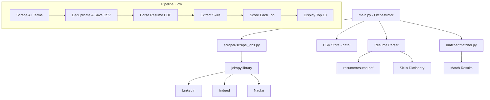

# Design Document: Job Copilot

## Overview

Job Copilot is a Python-based job search automation pipeline that scrapes job listings from LinkedIn, Indeed, and Naukri using the locally available `python-jobspy` library, persists results in daily CSV files, extracts skills from a resume PDF, and scores each job listing against the resume to surface the most relevant opportunities.

The system is designed as a single-run CLI tool invoked via `main.py`. It follows a linear pipeline: scrape → store → parse resume → extract skills → match → display results.

### Key Design Decisions

- **Leverage existing `python-jobspy` library**: The project already contains the `jobspy` package with scraper implementations for all target boards. The new `scraper/` module will be a thin wrapper around `jobspy.scrape_jobs()`.
- **PyPDF2 for PDF extraction**: Lightweight, pure-Python PDF text extraction without external dependencies like Tesseract.
- **Keyword-based matching over NLP**: Simple case-insensitive substring matching keeps the system dependency-free and deterministic, making it easy to test and reason about.
- **Single daily CSV file**: All search terms produce one combined, deduplicated file per day for simplicity.

## Architecture



### Module Responsibilities

| Module | File | Responsibility |
|--------|------|----------------|
| Scraper | `scraper/scrape_jobs.py` | Wraps `jobspy.scrape_jobs()` for configured search terms and boards |
| CSV Store | (inline in orchestrator) | Writes/overwrites daily CSV with deduplication |
| Resume Parser | `matcher/matcher.py` | Extracts text from PDF, identifies skills from dictionary |
| Matcher | `matcher/matcher.py` | Computes match score between skills list and job description |
| Orchestrator | `main.py` | Coordinates pipeline, handles errors, prints summary |

## Components and Interfaces

### 1. Scraper Module (`scraper/scrape_jobs.py`)

```python
def scrape_all_jobs(
    search_terms: list[str],
    sites: list[str],
    country: str,
    results_wanted: int
) -> pd.DataFrame:
    """
    Scrapes jobs for all search terms across all sites.
    
    Args:
        search_terms: List of role keywords to search for.
        sites: List of job board names (e.g., ["linkedin", "indeed", "naukri"]).
        country: Country code string (e.g., "india").
        results_wanted: Number of results per site per search term.
    
    Returns:
        Combined DataFrame of all job listings (may contain duplicates).
    
    Raises:
        No exceptions raised - errors per board are logged and skipped.
    """
```

**Behavior:**
- Iterates over each search term, calling `jobspy.scrape_jobs()` with the configured sites
- Catches exceptions per search term to ensure partial failures don't halt the pipeline
- Returns a concatenated DataFrame of all results

### 2. CSV Store (utility functions in orchestrator or scraper module)

```python
def save_jobs_to_csv(df: pd.DataFrame, output_dir: str = "data") -> str:
    """
    Deduplicates by job_url and saves to a daily CSV file.
    
    Args:
        df: DataFrame of job listings.
        output_dir: Directory path for CSV storage.
    
    Returns:
        The file path of the written CSV.
    
    Raises:
        IOError: If the file cannot be written.
    """
```

**Behavior:**
- Creates `data/` directory if it doesn't exist
- Deduplicates on `job_url`, keeping first occurrence
- Writes to `data/jobs_YYYY-MM-DD.csv` with UTF-8 encoding
- Overwrites if file already exists for today

### 3. Resume Parser (`matcher/matcher.py`)

```python
def extract_resume_text(pdf_path: str) -> str:
    """
    Extracts all text from a PDF resume file.
    
    Args:
        pdf_path: Path to the resume PDF file.
    
    Returns:
        Concatenated text from all pages, separated by newlines.
    
    Raises:
        FileNotFoundError: If the PDF file does not exist.
        ValueError: If the PDF is corrupted or contains no extractable text.
    """

def extract_skills(resume_text: str, skills_dict: list[str]) -> list[str]:
    """
    Extracts skills from resume text using case-insensitive matching.
    
    Args:
        resume_text: Full text content of the resume.
        skills_dict: List of known skill keywords to match against.
    
    Returns:
        Deduplicated list of matched skills as lowercase strings.
    """
```

### 4. Matcher (`matcher/matcher.py`)

```python
def compute_match(description: str, skills: list[str]) -> dict:
    """
    Computes a match score between a job description and a skills list.
    
    Args:
        description: Job listing description text.
        skills: List of skill strings extracted from resume.
    
    Returns:
        Dict with format: {"score": int, "matched_skills": list[str]}
        Score is percentage (0-100) of skills found, rounded down.
    """
```

### 5. Orchestrator (`main.py`)

```python
def main() -> None:
    """
    Entry point that runs the full pipeline:
    1. Scrape jobs for all search terms
    2. Deduplicate and save to CSV
    3. Parse resume and extract skills
    4. Score each job against skills
    5. Print summary with top 10 matches
    
    Exit codes:
        0: Success (including no results found)
        1: Resume file not found
    """
```

## Data Models

### Job Listing (CSV columns)

| Column | Type | Description |
|--------|------|-------------|
| site | str | Source job board name |
| title | str | Job title |
| company | str | Company name |
| location | str | Job location |
| job_url | str | Direct URL to the listing |
| description | str | Full job description |
| date_posted | str | Date the job was posted |
| job_type | str | Employment type (full-time, contract, etc.) |
| skills | str | Comma-separated skills from the listing |

### Match Result

```python
{
    "score": int,          # 0-100, percentage of skills matched (floor)
    "matched_skills": [    # List of skill strings found in description
        "python",
        "signal processing",
        ...
    ]
}
```

### Skills Dictionary Structure

A Python list of lowercase skill strings covering three domains:

- **Biomedical Engineering**: e.g., "biomedical engineering", "medical devices", "signal processing", "fda regulations", "clinical trials"
- **Software Development**: e.g., "python", "machine learning", "deep learning", "tensorflow", "docker", "git"
- **Embedded Systems**: e.g., "embedded systems", "iot", "firmware", "rtos", "pcb design", "arduino"

Minimum 50 entries. Multi-word skills are matched as substrings (e.g., "signal processing" matches if found anywhere in the text).

### Configuration Constants

```python
SEARCH_TERMS = [
    "Biomedical Engineer",
    "Medical Device Engineer", 
    "Research Engineer",
    "Healthcare AI",
    "Signal Processing Engineer",
    "Embedded Systems Engineer",
    "Python Developer",
    "IoT Engineer",
]

SITES = ["linkedin", "indeed", "naukri"]
COUNTRY = "india"
RESULTS_WANTED = 15
RESUME_PATH = "resume/resume.pdf"
OUTPUT_DIR = "data"
```

## Correctness Properties

*A property is a characteristic or behavior that should hold true across all valid executions of a system — essentially, a formal statement about what the system should do. Properties serve as the bridge between human-readable specifications and machine-verifiable correctness guarantees.*

### Property 1: Scraper resilience on partial failures

*For any* subset of job boards that fail during scraping, the scraper shall still return all results collected from the boards that succeeded, without raising an exception.

**Validates: Requirements 1.4**

### Property 2: CSV column completeness

*For any* DataFrame of job listings (including those with missing/None fields), the saved CSV shall contain all required columns (site, title, company, location, job_url, description, date_posted, job_type, skills) with empty strings substituted for any missing values.

**Validates: Requirements 2.3**

### Property 3: CSV combines all search term results

*For any* collection of DataFrames produced by multiple search terms, the CSV store shall combine them into a single output whose row count equals the sum of all input rows (before deduplication).

**Validates: Requirements 2.4**

### Property 4: Deduplication preserves first occurrence

*For any* list of job listings containing duplicate job_urls, deduplication shall produce a result where every job_url is unique and the retained row for each duplicate URL matches the first occurrence in the original input order.

**Validates: Requirements 2.5**

### Property 5: Skills extraction correctness

*For any* text string and skills dictionary, the extracted skills list shall contain exactly those dictionary entries (both single-word and multi-word) that appear as case-insensitive substrings in the text, and no others.

**Validates: Requirements 4.1, 4.2**

### Property 6: Skills output format invariant

*For any* input text and skills dictionary, every entry in the returned skills list shall be a lowercase string of at most 100 characters, and no skill shall appear more than once in the list.

**Validates: Requirements 4.3, 4.4**

### Property 7: Match score is bounded

*For any* job description string and skills list, the computed match score shall be an integer in the range [0, 100].

**Validates: Requirements 5.1**

### Property 8: Match score computation correctness

*For any* job description and skills list where the skills list is non-empty, the match score shall equal `floor(count_of_skills_found_in_description / len(skills_list) * 100)`, and the matched_skills list shall contain exactly those skills that appear as case-insensitive substrings in the description.

**Validates: Requirements 5.2, 5.3, 5.4**

## Error Handling

| Scenario | Module | Behavior |
|----------|--------|----------|
| Job board fails to respond | Scraper | Log error with board name and reason, continue with remaining boards |
| All boards return zero results | Scraper | Return empty DataFrame, no exception |
| `data/` directory missing | CSV Store | Create directory automatically |
| Filesystem write failure | CSV Store | Raise `IOError` with descriptive message including target path |
| Resume PDF not found | Resume Parser | Raise `FileNotFoundError` with file path |
| Resume PDF corrupted | Resume Parser | Raise `ValueError` with descriptive message |
| Resume PDF has no text (image-only) | Resume Parser | Raise `ValueError` indicating no extractable text |
| Empty job description | Matcher | Return `{"score": 0, "matched_skills": []}` |
| Empty skills list | Matcher | Return `{"score": 0, "matched_skills": []}` |
| Resume file missing at orchestrator level | Orchestrator | Print error message, exit with code 1 |
| No jobs scraped | Orchestrator | Print "no results" message, exit with code 0 |

### Error Propagation Strategy

- **Scraper errors**: Caught and logged internally; never propagate to orchestrator
- **CSV Store errors**: Propagate to orchestrator as `IOError`
- **Resume Parser errors**: Propagate to orchestrator as `FileNotFoundError` or `ValueError`
- **Matcher errors**: Should not occur given valid inputs; defensive checks return zero-score results

## Testing Strategy

### Unit Tests

Unit tests cover specific examples, edge cases, and error conditions:

- **Scraper**: Mock `jobspy.scrape_jobs()` to test error handling (board failures, empty results)
- **CSV Store**: Test file naming, directory creation, overwrite behavior, encoding
- **Resume Parser**: Test with known PDF fixtures for text extraction, error cases (missing file, corrupted file, image-only PDF)
- **Skills Extraction**: Test with known text containing specific skills, edge cases (no matches, repeated skills)
- **Matcher**: Test with known description/skills combinations, edge cases (empty description, empty skills)
- **Orchestrator**: Integration test with mocked dependencies verifying pipeline flow and exit codes

### Property-Based Tests

Property-based tests verify universal properties across randomized inputs using **Hypothesis** (Python PBT library):

- Each property test runs a minimum of **100 iterations**
- Each test is tagged with a comment referencing the design property
- Tag format: **Feature: job-copilot, Property {number}: {property_text}**

| Property | Test Description | Generator Strategy |
|----------|-----------------|-------------------|
| Property 1 | Generate random board failure combinations, verify resilience | Random subsets of ["linkedin", "indeed", "naukri"] to fail |
| Property 2 | Generate DataFrames with random None fields, verify CSV columns | Random DataFrames with optional None values per column |
| Property 3 | Generate multiple DataFrames, verify combined row count | Lists of random DataFrames with varying sizes |
| Property 4 | Generate job lists with duplicate URLs, verify dedup | Lists of jobs with controlled duplicate job_urls |
| Property 5 | Generate text with embedded skills, verify extraction | Random text + random subset of skills dictionary embedded |
| Property 6 | Generate arbitrary text, verify output format | Random strings as input text |
| Property 7 | Generate random descriptions and skills, verify score bounds | Random strings for description, random skill lists |
| Property 8 | Generate descriptions with known skill presence, verify score | Controlled descriptions where we know which skills appear |

### Test Dependencies

```
hypothesis>=6.0
pytest>=7.0
PyPDF2>=3.0  # for resume parsing implementation
```

### Test File Structure

```
tests/
├── test_scraper.py          # Unit + property tests for scraper module
├── test_csv_store.py        # Unit + property tests for CSV storage
├── test_resume_parser.py    # Unit tests for PDF extraction
├── test_skills_extraction.py # Unit + property tests for skills extraction
├── test_matcher.py          # Unit + property tests for matcher
├── test_orchestrator.py     # Integration tests for main pipeline
└── fixtures/
    ├── sample_resume.pdf    # Known test PDF
    └── corrupted.pdf        # Corrupted PDF for error testing
```

