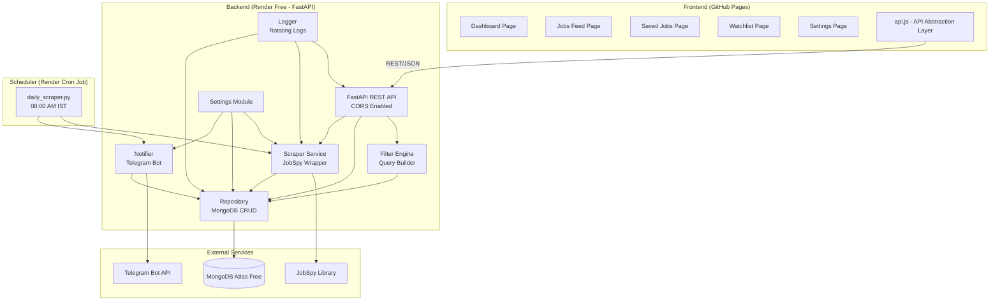
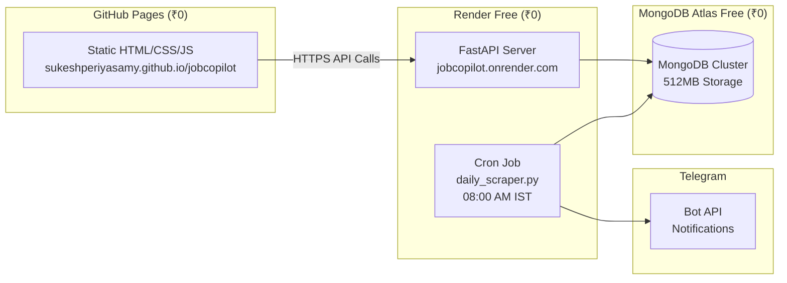
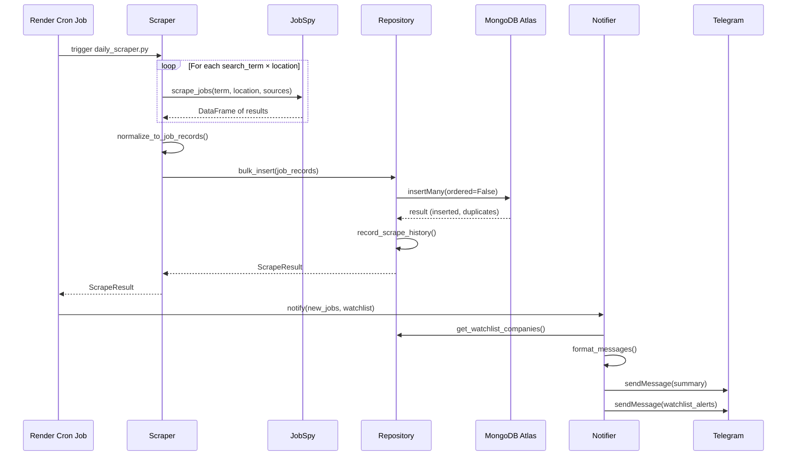

# Design Document: JobCopilot Engine

## Overview

JobCopilot Engine is a personal job search automation system that scrapes, stores, filters, and tracks job listings from multiple Indian job portals. The system uses a **split architecture**: a static frontend on GitHub Pages, a FastAPI REST backend on Render Free, MongoDB Atlas Free for persistence, and a Render Cron Job for daily scheduled scraping.

The system is designed to run entirely on free-tier resources (₹0/month total). No AI/ML matching, no LLM integration — purely functional automation with a modern SaaS-inspired UI.

### Key Design Decisions

1. **Static Frontend on GitHub Pages over Streamlit**: Zero-cost hosting, mobile-responsive, modern dark-mode glassmorphism design inspired by Vercel/Linear/GitHub. Streamlit is server-rendered Python which doesn't work well on free hosting and lacks mobile responsiveness.
2. **FastAPI Backend on Render Free over monolithic Streamlit**: Clean REST API with CORS, Pydantic models, async support. Separates concerns and allows independent deployment of frontend/backend.
3. **Render Cron Job over APScheduler**: Render free services sleep after 15 minutes of inactivity, making in-process schedulers unreliable. A Render Cron Job triggers `daily_scraper.py` externally at 08:00 AM IST.
4. **MongoDB Atlas Free**: Provides deduplication via unique indexes, efficient querying, and persistent state. Same collections as before.
5. **JobSpy as scraping layer**: The existing `jobspy` library handles multi-source scraping. We wrap it with normalization.
6. **python-dotenv for configuration**: Keeps secrets out of code, supports `.env` files for local dev and environment variables for Render deployment.

### Future Roadmap

- v2: Telegram Notifications (daily summaries + watchlist alerts)
- v3: Resume Upload & Storage
- v4: Job Match % (keyword-based scoring)
- v5: Enhanced Application Tracker
- v6: Research Opportunities (IISc, DRDO, CDAC)

## Architecture



### Deployment Architecture



### Workflow Sequence



## Components and Interfaces

### 1. Frontend (GitHub Pages)

Static HTML/CSS/JS application with dark mode glassmorphism design.

**Design System:**
- Dark mode with glassmorphism (frosted glass cards, subtle borders, backdrop blur)
- Inspired by Vercel, Linear, GitHub, Notion
- CSS variables for theming, modular JavaScript, reusable components
- Responsive mobile-first design
- Loading skeletons, empty states, infinite scroll/pagination

**Pages:**
- `index.html` — Dashboard: Top metric cards (Total Jobs, Today's Jobs, This Week, Saved, Applied), recent jobs table
- `jobs.html` — Jobs Feed: Full paginated table with search, filters (source, location, company, job type, date), Apply/Save actions
- `saved.html` — Saved Jobs: Bookmarked jobs with Remove action
- `watchlist.html` — Watchlist: Add/remove companies (default: Siemens Healthineers, GE HealthCare, Philips, Medtronic, Abbott, Dozee)
- `settings.html` — Settings: Configure search terms, locations, sources

**Fresh Jobs Badges:**
- 🟢 Posted Today
- 🟡 Posted This Week
- ⚪ Older

**API Abstraction Layer (`js/api.js`):**
```javascript
const API_BASE = 'https://jobcopilot.onrender.com';

export async function getJobs(params) { /* GET /jobs?page=&source=&location=&... */ }
export async function getRecentJobs() { /* GET /jobs/recent */ }
export async function searchJobs(query) { /* GET /jobs/search?q= */ }
export async function getStats() { /* GET /stats */ }
export async function getWatchlist() { /* GET /watchlist */ }
export async function addToWatchlist(company) { /* POST /watchlist */ }
export async function saveJob(jobData) { /* POST /save-job */ }
export async function applyJob(jobData) { /* POST /apply-job */ }
export async function getHealth() { /* GET /health */ }
```

### 2. Backend — FastAPI REST API (`backend/app/api/`)

**Framework**: FastAPI with CORS middleware enabled for `https://sukeshperiyasamy.github.io`

**Endpoints:**

| Method | Path | Description |
|--------|------|-------------|
| GET | `/health` | Health check, returns `{"status": "ok"}` |
| GET | `/jobs` | Paginated jobs with query params: `page`, `page_size`, `source`, `location`, `company`, `keyword`, `job_type`, `date_from`, `date_to`, `search_term` |
| GET | `/jobs/recent` | Top 10 most recently posted jobs |
| GET | `/jobs/search?q=` | Full-text search across title and description |
| GET | `/jobs/company/{name}` | Jobs from a specific company |
| GET | `/stats` | Dashboard summary metrics |
| GET | `/watchlist` | List all watchlist companies |
| POST | `/watchlist` | Add company to watchlist |
| DELETE | `/watchlist/{company}` | Remove company from watchlist |
| POST | `/save-job` | Save a job to saved_jobs collection |
| DELETE | `/save-job/{job_url}` | Remove from saved jobs |
| POST | `/apply-job` | Mark job as applied with status |
| PATCH | `/apply-job/{job_url}` | Update application status |

**CORS Configuration:**
```python
app.add_middleware(
    CORSMiddleware,
    allow_origins=["https://sukeshperiyasamy.github.io"],
    allow_credentials=True,
    allow_methods=["*"],
    allow_headers=["*"],
)
```

### 3. Settings Module (`backend/app/config/settings.py`)

Loads configuration from `.env` file and environment variables using python-dotenv.

```python
@dataclass
class Settings:
    # MongoDB
    mongodb_uri: str              # Required, raises on missing
    database_name: str            # Default: "jobcopilot"

    # Telegram
    telegram_bot_token: str | None  # Optional, None if not set
    telegram_chat_id: str | None    # Optional, None if not set

    # Scraping
    search_terms: list[str]       # Comma-separated, has defaults
    locations: list[str]          # Comma-separated, has defaults
    job_sources: list[str]        # Default: linkedin,indeed,naukri,google

    # Scheduling
    schedule_time: str            # HH:MM format, default: "08:00"

    @classmethod
    def load() -> "Settings":
        """Load from .env then environment variables. Validates required fields."""
        ...
```

### 4. Scraper Service (`backend/app/scraper/`)

Wraps JobSpy with normalization and error handling.

```python
@dataclass
class JobRecord:
    title: str
    company: str
    location: str
    source: str
    job_url: str
    description: str
    job_type: str
    salary: str
    date_posted: str          # YYYY-MM-DD or ""
    search_term: str          # The search term that found this job
    created_at: str           # ISO 8601
    updated_at: str           # ISO 8601

@dataclass
class ScrapeResult:
    jobs: list[JobRecord]
    errors: list[str]

def scrape_all(settings: Settings) -> ScrapeResult:
    """
    Scrapes all search_term × location combinations across configured sources.
    Uses ThreadPoolExecutor with max_workers=4.
    Returns normalized JobRecords and any errors encountered.
    """
    ...
```

### 5. Repository Module (`backend/app/database/repository.py`)

Handles all MongoDB operations.

```python
class JobsRepository:
    def __init__(self, settings: Settings):
        """Connect to MongoDB Atlas, ensure indexes exist."""
        ...

    def bulk_insert(self, records: list[JobRecord]) -> BulkInsertResult:
        """Insert records with ordered=False. Skip duplicates via unique index."""
        ...

    def record_scrape_history(self, result: ScrapeHistoryEntry) -> None:
        """Write scrape run metadata to scrape_history collection."""
        ...

    def get_jobs(self, filters: FilterCriteria, page: int, page_size: int) -> PaginatedResult:
        """Query jobs with filters and pagination. Returns jobs + total count."""
        ...

    def get_recent_jobs(self, limit: int = 10) -> list[JobRecord]:
        """Return most recently posted jobs, ordered by date_posted desc."""
        ...

    def search_jobs(self, query: str, page: int, page_size: int) -> PaginatedResult:
        """Full-text search across title and description fields."""
        ...

    def get_jobs_by_company(self, company: str) -> list[JobRecord]:
        """Return all jobs from a specific company."""
        ...

    def save_job(self, job_data: dict) -> bool:
        """Store job in saved_jobs. Returns False if already saved."""
        ...

    def remove_saved_job(self, job_url: str) -> bool:
        """Remove from saved_jobs collection."""
        ...

    def add_applied_job(self, job_data: dict, status: str = "Interested") -> None:
        """Add job to applied_jobs with initial status."""
        ...

    def update_application_status(self, job_url: str, status: str) -> None:
        """Update status field in applied_jobs."""
        ...

    def get_watchlist(self) -> list[str]:
        """Return all company names from company_watchlist."""
        ...

    def add_to_watchlist(self, company: str) -> bool:
        """Add company to watchlist. Max 50 entries, max 100 chars per name."""
        ...

    def remove_from_watchlist(self, company: str) -> bool:
        """Remove company from watchlist."""
        ...

    def get_stats(self) -> dict:
        """Return dashboard summary metrics (total, today, this_week, saved, applied)."""
        ...
```

### 6. Filter Engine (`backend/app/services/filter_engine.py`)

Builds MongoDB query documents from API query parameters.

```python
@dataclass
class FilterCriteria:
    source: str | None = None           # Case-insensitive exact match
    location: str | None = None         # Case-insensitive substring
    company: str | None = None          # Case-insensitive substring
    keyword: str | None = None          # Substring in title OR description
    job_type: str | None = None         # Case-insensitive exact match
    date_from: str | None = None        # YYYY-MM-DD inclusive
    date_to: str | None = None          # YYYY-MM-DD inclusive
    search_term: str | None = None      # Case-insensitive exact match

def build_query(criteria: FilterCriteria) -> dict:
    """
    Converts FilterCriteria into a MongoDB query document.
    Ignores None/empty fields. Combines all present criteria with AND logic.
    Returns empty dict if no criteria specified.
    """
    ...
```

### 7. Notifier Module (`backend/app/services/notifier.py`)

Sends Telegram messages via Bot API.

```python
class TelegramNotifier:
    MAX_MESSAGE_LENGTH = 4096

    def __init__(self, bot_token: str | None, chat_id: str | None):
        """Initialize. If token/chat_id missing, all sends become no-ops with warning log."""
        ...

    def notify_new_jobs(self, jobs: list[JobRecord]) -> None:
        """Send summary of new jobs. Splits into multiple messages if needed."""
        ...

    def notify_watchlist_match(self, job: JobRecord) -> None:
        """Send separate alert for watchlist company match."""
        ...

    def mark_notified(self, job_urls: list[str]) -> None:
        """Track which jobs have been notified to avoid re-sending."""
        ...
```

### 8. Daily Scraper (Render Cron Job) (`backend/daily_scraper.py`)

Standalone script triggered by Render Cron Job at 08:00 AM IST.

```python
def main():
    """
    Render Cron Job entry point:
    1. Load settings
    2. Run scrape_all() for all search_term × location combinations
    3. Bulk insert to MongoDB (deduplication via unique index)
    4. Record scrape history
    5. Send Telegram notifications for new jobs
    6. Send watchlist alerts for matching companies
    """
    settings = Settings.load()
    result = scrape_all(settings)
    repo = JobsRepository(settings)
    insert_result = repo.bulk_insert(result.jobs)
    repo.record_scrape_history(insert_result)
    notifier = TelegramNotifier(settings.telegram_bot_token, settings.telegram_chat_id)
    notifier.notify_new_jobs(insert_result.new_jobs)
    # Watchlist alerts
    watchlist = repo.get_watchlist()
    for job in insert_result.new_jobs:
        if job.company.lower() in [w.lower() for w in watchlist]:
            notifier.notify_watchlist_match(job)
```

### 9. Logger Module (`backend/app/utils/logger.py`)

Configures rotating file + console logging.

```python
def setup_logging() -> logging.Logger:
    """
    Configure root logger with:
    - RotatingFileHandler: data/jobcopilot.log, 10MB max, 5 backups
    - StreamHandler: console output
    - Format: ISO 8601 timestamp | LEVEL | module | message
    """
    ...
```

### 10. Application Entry Point (`backend/main.py`)

FastAPI application entry point for Render deployment.

```python
from fastapi import FastAPI
from app.api import jobs, watchlist, stats, health

app = FastAPI(title="JobCopilot API", version="1.0.0")

# Register routers
app.include_router(health.router)
app.include_router(jobs.router)
app.include_router(watchlist.router)
app.include_router(stats.router)

# CLI support for local development
def main():
    """
    CLI entry point:
      python main.py serve      → start FastAPI with uvicorn
      python main.py scrape     → single scrape cycle, exit 0/1
      python main.py            → show help, exit 0
      python main.py <invalid>  → show error + help, exit 2
    """
    ...
```

## Data Models

### MongoDB Collections

#### `jobs` Collection

```json
{
  "_id": "ObjectId",
  "title": "string (required)",
  "company": "string (required)",
  "location": "string",
  "source": "string (linkedin|indeed|naukri|google)",
  "job_url": "string (required, unique index)",
  "description": "string",
  "job_type": "string (full-time|part-time|internship|contract|'')",
  "salary": "string",
  "date_posted": "string (YYYY-MM-DD or '')",
  "search_term": "string",
  "created_at": "string (ISO 8601)",
  "updated_at": "string (ISO 8601)",
  "notified": "boolean (default false)"
}
```

**Indexes:**
- `job_url`: unique
- `date_posted`: ascending
- `source`: ascending
- `company`: ascending

#### `saved_jobs` Collection

```json
{
  "_id": "ObjectId",
  "job_url": "string (unique)",
  "title": "string",
  "company": "string",
  "location": "string",
  "source": "string",
  "date_posted": "string",
  "date_saved": "string (ISO 8601)"
}
```

#### `applied_jobs` Collection

```json
{
  "_id": "ObjectId",
  "job_url": "string (unique)",
  "title": "string",
  "company": "string",
  "location": "string",
  "status": "string (Interested|Applied|Assessment|Interview|Offer|Rejected|Joined)",
  "date_applied": "string (ISO 8601)",
  "updated_at": "string (ISO 8601)"
}
```

#### `company_watchlist` Collection

```json
{
  "_id": "ObjectId",
  "company_name": "string (max 100 chars, unique)"
}
```

**Default watchlist entries:** Siemens Healthineers, GE HealthCare, Philips, Medtronic, Abbott, Dozee

#### `scrape_history` Collection

```json
{
  "_id": "ObjectId",
  "timestamp": "string (UTC ISO 8601)",
  "jobs_found": "integer",
  "duplicates_skipped": "integer",
  "errors": ["string"]
}
```

#### `notifications` Collection

```json
{
  "_id": "ObjectId",
  "job_url": "string (unique)",
  "notified_at": "string (ISO 8601)"
}
```

### Pydantic Models (API Request/Response)

```python
from pydantic import BaseModel
from typing import Optional

class JobResponse(BaseModel):
    title: str
    company: str
    location: str
    source: str
    job_url: str
    description: str
    job_type: str
    salary: str
    date_posted: str
    search_term: str
    created_at: str
    updated_at: str

class PaginatedJobsResponse(BaseModel):
    jobs: list[JobResponse]
    total: int
    page: int
    page_size: int
    total_pages: int

class StatsResponse(BaseModel):
    total_jobs: int
    jobs_today: int
    jobs_this_week: int
    saved_jobs: int
    applied_jobs: int
    companies_tracked: int

class SaveJobRequest(BaseModel):
    job_url: str
    title: str
    company: str
    location: str
    source: str
    date_posted: str

class ApplyJobRequest(BaseModel):
    job_url: str
    title: str
    company: str
    location: str
    status: str = "Interested"

class WatchlistRequest(BaseModel):
    company_name: str
```

### Project Structure

```
jobcopilot/
├── backend/
│   ├── app/
│   │   ├── __init__.py
│   │   ├── api/
│   │   │   ├── __init__.py
│   │   │   ├── health.py          # GET /health
│   │   │   ├── jobs.py            # GET /jobs, /jobs/recent, /jobs/search, /jobs/company
│   │   │   ├── watchlist.py       # GET/POST/DELETE /watchlist
│   │   │   ├── saved.py           # POST/DELETE /save-job
│   │   │   ├── applied.py         # POST/PATCH /apply-job
│   │   │   └── stats.py           # GET /stats
│   │   ├── scraper/
│   │   │   ├── __init__.py
│   │   │   └── scraper.py         # JobSpy wrapper + normalization
│   │   ├── database/
│   │   │   ├── __init__.py
│   │   │   ├── connection.py      # MongoDB client singleton
│   │   │   └── repository.py      # MongoDB CRUD operations
│   │   ├── services/
│   │   │   ├── __init__.py
│   │   │   ├── filter_engine.py   # Query builder
│   │   │   └── notifier.py        # Telegram integration
│   │   ├── models/
│   │   │   ├── __init__.py
│   │   │   ├── job.py             # JobRecord dataclass
│   │   │   └── schemas.py         # Pydantic request/response models
│   │   ├── utils/
│   │   │   ├── __init__.py
│   │   │   ├── logger.py          # Rotating log setup
│   │   │   └── retry.py           # Retry with exponential backoff
│   │   └── config/
│   │       ├── __init__.py
│   │       └── settings.py        # Configuration loader
│   ├── tests/
│   │   ├── test_scraper.py
│   │   ├── test_repository.py
│   │   ├── test_filter_engine.py
│   │   ├── test_notifier.py
│   │   ├── test_settings.py
│   │   ├── test_watchlist.py
│   │   ├── test_pagination.py
│   │   ├── test_cli.py
│   │   └── conftest.py            # Shared fixtures and strategies
│   ├── daily_scraper.py           # Render Cron Job entry point
│   ├── main.py                    # FastAPI app + CLI entry point
│   ├── requirements.txt
│   └── .env.example
├── frontend/
│   ├── index.html                 # Dashboard page
│   ├── jobs.html                  # Jobs feed page
│   ├── saved.html                 # Saved jobs page
│   ├── watchlist.html             # Watchlist page
│   ├── settings.html              # Settings page
│   ├── css/
│   │   └── style.css              # Dark mode + glassmorphism
│   ├── js/
│   │   ├── api.js                 # API abstraction layer
│   │   ├── dashboard.js           # Dashboard page logic
│   │   ├── jobs.js                # Jobs feed logic (pagination, filters)
│   │   ├── saved.js               # Saved jobs logic
│   │   ├── watchlist.js           # Watchlist logic
│   │   └── components.js          # Reusable UI components
│   └── assets/
│       └── favicon.ico
├── docs/
├── .gitignore
├── LICENSE
└── README.md
```

## Correctness Properties

*A property is a characteristic or behavior that should hold true across all valid executions of a system — essentially, a formal statement about what the system should do. Properties serve as the bridge between human-readable specifications and machine-verifiable correctness guarantees.*

### Property 1: Scraper combination coverage

*For any* list of search terms and list of locations, the scraper SHALL invoke JobSpy exactly `len(search_terms) × len(locations)` times, once for each unique (term, location) pair.

**Validates: Requirements 1.1**

### Property 2: Normalization correctness

*For any* valid JobSpy result row containing at least a title and job_url, the normalization function SHALL produce a JobRecord where: all required fields (title, company, location, source, job_url, description, job_type, salary, date_posted, search_term, created_at, updated_at) are present as strings, optional missing fields default to empty string, and records missing title or job_url are excluded from the output.

**Validates: Requirements 1.5, 1.6, 7.5**

### Property 3: Source failure resilience

*For any* set of job sources where a subset fails with errors, the scraper SHALL return all results from non-failing sources without loss, and the error list SHALL contain exactly one entry per failed source-term-location combination.

**Validates: Requirements 1.7, 7.1**

### Property 4: Deduplication counting

*For any* list of JobRecords where N records share duplicate job_urls, the bulk insert operation SHALL report `duplicates_skipped` equal to the number of records that could not be inserted due to the unique constraint (total records minus unique job_urls that were successfully inserted).

**Validates: Requirements 2.3**

### Property 5: Scrape history accuracy

*For any* completed scrape cycle producing J total records with D duplicates skipped and E errors, the recorded scrape_history entry SHALL have `jobs_found == J`, `duplicates_skipped == D`, and `len(errors) == E`.

**Validates: Requirements 2.7**

### Property 6: Filter query building — single criterion

*For any* single non-null filter criterion (source, location, company, keyword, job_type, date range, or search_term), the `build_query` function SHALL produce a MongoDB query document that: uses case-insensitive regex for substring matches (location, company, keyword), uses case-insensitive exact match for enumerated values (source, job_type, search_term), uses `$or` on title and description for keyword, and uses `$gte`/`$lte` for date ranges.

**Validates: Requirements 3.1, 3.2, 3.3, 3.4, 3.5, 3.6, 3.7**

### Property 7: Filter composition with AND logic

*For any* FilterCriteria with K non-null fields (where K ≥ 0), the resulting MongoDB query document SHALL contain exactly K conditions combined with implicit AND, and fields with None or empty values SHALL not appear in the query.

**Validates: Requirements 3.8, 3.10**

### Property 8: Watchlist validation

*For any* company name string, the watchlist SHALL accept it if and only if: the name length is between 1 and 100 characters inclusive, AND the current watchlist size is less than 50. Names exceeding 100 characters or additions beyond 50 entries SHALL be rejected.

**Validates: Requirements 4.10**

### Property 9: Pagination calculation

*For any* total job count N and page size P (default 50), the API pagination SHALL produce `ceil(N / P)` total pages, and each page (except possibly the last) SHALL contain exactly P records. The response includes total count, current page, page size, and total pages for frontend rendering.

**Validates: Requirements 4.12, 10.3**

### Property 10: Message formatting with size limit

*For any* list of JobRecords, the Telegram message formatter SHALL produce one or more message strings where: each message is at most 4096 characters, every job's title, company, location, and job_url appear in exactly one message, and no job's information is split across messages.

**Validates: Requirements 5.2**

### Property 11: Notification filtering

*For any* set of jobs where some are marked as previously notified and a watchlist of company names exists, the notification system SHALL: include only un-notified jobs in the summary message, and send a separate watchlist alert for each un-notified job whose company name matches a watchlist entry (case-insensitive).

**Validates: Requirements 5.3, 5.4**

### Property 12: Schedule time validation

*For any* string S, the time validator SHALL accept S if and only if S matches the pattern `HH:MM` where HH is in [00, 23] and MM is in [00, 59]. All other strings SHALL be rejected with a descriptive error.

**Validates: Requirements 6.2, 9.6**

### Property 13: Retry with exponential backoff

*For any* operation configured with max_retries=R and initial_backoff=B seconds, if the operation fails F times consecutively (where F ≤ R), the system SHALL retry exactly min(F, R) times with delays of B, 2B, 4B, ..., 2^(min(F,R)-1) × B seconds. If F > R, the system SHALL stop after R retries and log a final failure.

**Validates: Requirements 6.4, 7.2, 7.3**

### Property 14: Settings loading with defaults

*For any* subset of configuration keys provided via environment variables, the Settings loader SHALL: use the provided value for each present key, use the documented default value for each absent key (except MONGODB_URI which raises an error when absent), and parse comma-separated strings into lists.

**Validates: Requirements 9.1, 9.3**

### Property 15: CLI argument handling

*For any* string argument that is not one of {"serve", "scrape"}, the application SHALL exit with code 2 and display an error message containing the invalid argument name followed by the list of valid commands.

**Validates: Requirements 11.5**

## Error Handling

### Error Categories and Responses

| Error Source | Behavior | Retry | Impact |
|---|---|---|---|
| JobSpy source failure | Log error, continue with other sources | No retry per source | Partial results collected |
| JobSpy all sources fail | Return empty result set | No | Empty scrape cycle |
| MongoDB connection failure | Retry 3× with exponential backoff (1s, 2s, 4s) | Yes | Blocks storage until resolved |
| MongoDB bulk insert duplicate | Skip duplicate, increment counter | No | Expected behavior |
| MongoDB bulk insert invalid record | Skip record, log error | No | Record lost, logged |
| Telegram API failure | Retry 3× with exponential backoff (1s, 2s, 4s) | Yes | Notifications delayed/lost |
| Telegram not configured | Log warning, skip all notifications | No | Silent operation |
| Cron job workflow failure | Retry 3× with exponential backoff (60s, 120s, 240s) | Yes | Delayed scrape cycle |
| Invalid schedule time format | Raise error at startup | No | Application won't start |
| Missing MONGODB_URI | Raise error at startup | No | Application won't start |
| API request with invalid params | Return 422 with validation error | No | Client gets error response |
| Frontend API unreachable | Display error state in UI, retry button | No | Degraded frontend |

### Retry Strategy

All retry logic uses the same utility pattern:
```python
def retry_with_backoff(fn, max_retries: int, initial_backoff: float):
    for attempt in range(max_retries):
        try:
            return fn()
        except Exception as e:
            if attempt == max_retries - 1:
                raise
            sleep_time = initial_backoff * (2 ** attempt)
            time.sleep(sleep_time)
            logger.warning(f"Attempt {attempt + 1} failed: {e}. Retrying in {sleep_time}s...")
```

### Graceful Degradation

- If scraping partially fails → partial results are still stored and notified
- If MongoDB is down → API returns 503 Service Unavailable; frontend shows error state
- If Telegram is down → scraping and storage continue normally, notifications are lost
- If cron job fails → retries with backoff; if all retries fail, waits for next day's trigger
- If frontend can't reach backend → shows loading skeleton then error state with retry button

## Testing Strategy

### Property-Based Testing

The project uses **Hypothesis** (already in dev dependencies) for property-based testing. Each correctness property maps to one property-based test with minimum 100 iterations.

**Library**: `hypothesis` (version ≥6.0, already in pyproject.toml)
**Configuration**: Each test uses `@given()` with `@settings(max_examples=100)`

**Tag format**: Each test includes a docstring with:
```
Feature: jobcopilot-engine, Property {number}: {property_text}
```

### Test Organization

```
backend/tests/
├── test_scraper.py           # Properties 1, 2, 3
├── test_repository.py        # Properties 4, 5
├── test_filter_engine.py     # Properties 6, 7
├── test_notifier.py          # Properties 10, 11
├── test_settings.py          # Properties 12, 14
├── test_watchlist.py         # Property 8
├── test_pagination.py        # Property 9
├── test_retry.py             # Property 13
├── test_cli.py               # Property 15
├── test_api.py               # API endpoint integration tests
└── conftest.py               # Shared fixtures and strategies
```

### Unit Tests (Example-Based)

Unit tests cover:
- Specific configuration scenarios (missing .env, default values)
- CLI commands (serve, scrape, help)
- Logger setup verification (handlers, format, rotation config)
- API endpoint response structure and status codes
- Telegram message content for specific job data
- Frontend API abstraction layer (mocked fetch)

### Integration Tests

Integration tests cover:
- MongoDB bulk insert with real test database
- Index creation verification
- End-to-end workflow: scrape → store → notify (with mocked external services)
- FastAPI endpoint testing with TestClient
- CORS header verification
- Pagination with real data

### Mocking Strategy

- **JobSpy**: Mocked at the `jobspy.scrape_jobs` function level, returning controlled DataFrames
- **MongoDB**: Use `mongomock` or a test MongoDB instance for integration tests; mock `pymongo.MongoClient` for unit tests
- **Telegram API**: Mock `requests.post` to Telegram endpoints
- **Time/Sleep**: Mock `time.sleep` in retry tests to avoid actual delays
- **FastAPI**: Use `httpx.AsyncClient` with `app` for API tests

### Test Execution

```bash
# Run all tests
cd backend && pytest tests/ -v

# Run only property-based tests
pytest tests/ -v -k "property"

# Run with coverage
pytest tests/ --cov=app --cov-report=term-missing

# Run API integration tests
pytest tests/test_api.py -v
```
