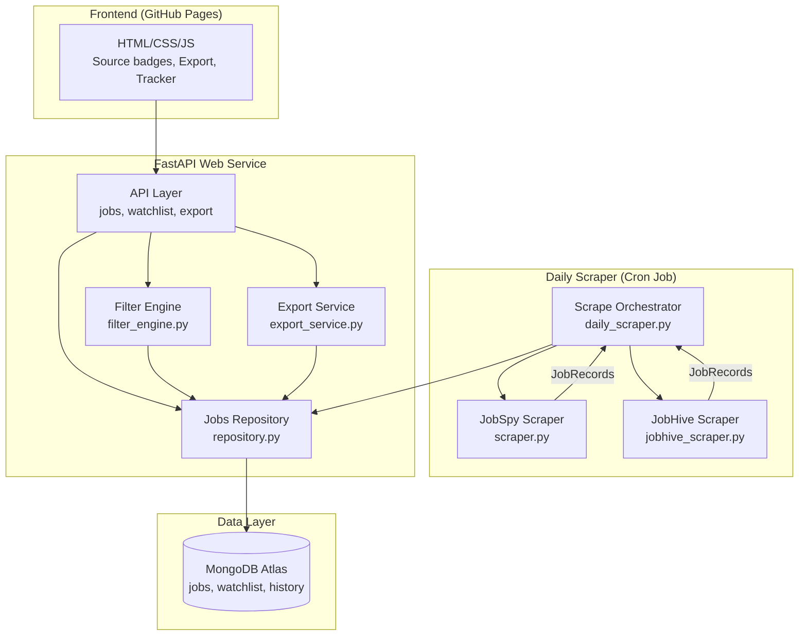

# Design Document: JobCopilot v1.1 Upgrade

## Overview

JobCopilot v1.1 extends the existing job scraping and tracking system with a second data source (JobHive via `jobhive-py`), enhanced metadata, ATS-based filtering, job export, and a company tracker with ATS platform information. The upgrade is backward compatible with all existing v1.0 data and APIs, and remains within free-tier resource limits.

The design follows the existing architecture patterns: Python dataclasses for models, repository pattern for data access, a filter engine for query building, and FastAPI routers for API endpoints. New capabilities are added as new modules alongside existing ones, with minimal modification to existing code.

## Architecture



**Key architectural decisions:**

1. **Sequential scraper execution**: JobSpy runs first, then JobHive. This avoids resource contention on the free tier and simplifies error handling (one failure doesn't affect the other).
2. **In-memory export**: CSV/XLSX files are generated in BytesIO buffers and streamed directly, avoiding disk I/O on Render's ephemeral filesystem.
3. **Read-time backward compatibility**: Legacy records missing `source_type`/`source_platform` are handled at the repository read layer rather than requiring a data migration.
4. **Additive schema changes**: New fields are added to the dataclass with defaults; existing documents remain valid without modification.

## Components and Interfaces

### 1. JobHive Scraper (`backend/app/scraper/jobhive_scraper.py`)

**Responsibility**: Query jobhive-py for each configured ATS platform and normalize results into `JobRecord` instances.

```python
def scrape_jobhive(settings: Settings) -> ScrapeResult:
    """Query all configured ATS platforms via jobhive-py.
    
    Iterates over platforms (greenhouse, lever, ashby, workday, successfactors),
    queries each with configured search terms, normalizes results, and collects errors.
    Continues on per-platform failures.
    
    Returns:
        ScrapeResult with normalized JobRecords and any error messages.
    """
    ...

def _normalize_jobhive_result(raw: dict, platform: str, search_term: str) -> JobRecord | None:
    """Normalize a single jobhive-py result dict into a JobRecord.
    
    Sets source_type="jobhive", source_platform=platform.
    Returns None if required fields (title, job_url) are missing.
    """
    ...
```

**Configuration**: ATS platforms are defined as a constant list. Company-specific board identifiers (e.g., Greenhouse board tokens) are loaded from environment variables via Settings.

### 2. Updated JobSpy Scraper (`backend/app/scraper/scraper.py`)

**Change**: The existing `_normalize_row` function is updated to populate `source_type="jobspy"` and `source_platform` from the `site` field (lowercased).

```python
# Addition to _normalize_row return:
source_type="jobspy",
source_platform=str(row.get("site", "") or "").strip().lower(),
```

### 3. Scrape Orchestrator (`backend/daily_scraper.py`)

**Change**: The `_run_workflow` function is updated to invoke both scrapers and merge results.

```python
def _run_workflow() -> None:
    """Execute the full scrape-store-notify workflow with both scrapers."""
    settings = Settings.load()
    
    # Run JobSpy
    jobspy_result = _run_jobspy(settings)  # wraps scrape_all with error handling
    
    # Run JobHive
    jobhive_result = _run_jobhive(settings)  # wraps scrape_jobhive with error handling
    
    # Merge results
    merged_jobs = jobspy_result.jobs + jobhive_result.jobs
    merged_errors = jobspy_result.errors + jobhive_result.errors
    merged_result = ScrapeResult(jobs=merged_jobs, errors=merged_errors)
    
    # Continue with existing bulk insert, history, notification logic...
```

### 4. Extended Filter Engine (`backend/app/services/filter_engine.py`)

**Change**: Add handling for `source_type` and `source_platform` fields in `build_query`.

```python
# New FilterCriteria fields:
source_type: str | None = None
source_platform: str | None = None

# New filter logic in build_query:
if criteria.source_type:
    conditions.append(
        {"source_type": {"$regex": f"^{re.escape(criteria.source_type)}$", "$options": "i"}}
    )

if criteria.source_platform:
    if criteria.source_platform.lower() == "ats":
        conditions.append(
            {"source_platform": {"$in": ["greenhouse", "lever", "ashby", "workday", "successfactors"]}}
        )
    else:
        conditions.append(
            {"source_platform": {"$regex": f"^{re.escape(criteria.source_platform)}$", "$options": "i"}}
        )
```

### 5. Export Service (`backend/app/services/export_service.py`)

**Responsibility**: Generate CSV and XLSX files from filtered job data in-memory.

```python
from io import BytesIO

EXPORT_COLUMNS = [
    "title", "company", "location", "source", "source_type", "source_platform",
    "job_url", "description", "job_type", "salary", "date_posted", "search_term", "created_at"
]
MAX_EXPORT_RECORDS = 10000

def export_csv(jobs: list[JobRecord]) -> tuple[BytesIO, bool]:
    """Generate CSV from job records. Returns (buffer, was_truncated)."""
    ...

def export_xlsx(jobs: list[JobRecord]) -> tuple[BytesIO, bool]:
    """Generate XLSX from job records. Returns (buffer, was_truncated)."""
    ...
```

### 6. Export API Router (`backend/app/api/export.py`)

```python
@router.get("/export/csv")
def export_jobs_csv(
    # All filter params including source_type, source_platform
) -> StreamingResponse:
    """Export filtered jobs as CSV download."""
    ...

@router.get("/export/xlsx")
def export_jobs_xlsx(
    # All filter params including source_type, source_platform
) -> StreamingResponse:
    """Export filtered jobs as XLSX download."""
    ...
```

### 7. Updated Watchlist API (`backend/app/api/watchlist.py`)

**Changes**:
- `GET /watchlist` returns `[{company_name, ats_platform}]` instead of `[str]`
- `POST /watchlist` accepts optional `ats_platform` field
- New `GET /watchlist/ats-info` endpoint returns companies grouped by platform

### 8. Updated Repository (`backend/app/database/repository.py`)

**Changes**:
- `ensure_indexes` adds indexes on `source_type` and `source_platform`
- `_doc_to_job_record` handles backward compatibility for missing fields
- `get_export_jobs` method for fetching filtered jobs up to 10000 limit
- Watchlist methods updated to handle `ats_platform` field
- Updated default watchlist seed with ATS platform info

### 9. Frontend Updates

- **Source badges**: Job cards display color-coded pill badges based on `source_platform`
- **Export controls**: Two buttons (CSV, XLSX) near filter controls with loading states
- **Company tracker**: Enhanced watchlist page showing ATS platform badges and add form with platform dropdown
- **Filter updates**: Source dropdown expanded with ATS platform options

## Data Models

### Updated JobRecord

```python
@dataclass
class JobRecord:
    title: str
    company: str
    location: str
    source: str
    job_url: str
    description: str = ""
    job_type: str = ""
    salary: str = ""
    date_posted: str = ""
    search_term: str = ""
    source_type: str = ""       # NEW: "jobspy" or "jobhive"
    source_platform: str = ""   # NEW: linkedin, indeed, naukri, google, workday, greenhouse, lever, ashby, successfactors
    created_at: str = field(default_factory=lambda: datetime.now(timezone.utc).isoformat())
    updated_at: str = field(default_factory=lambda: datetime.now(timezone.utc).isoformat())
```

### Updated FilterCriteria

```python
@dataclass
class FilterCriteria:
    source: str | None = None
    location: str | None = None
    company: str | None = None
    keyword: str | None = None
    job_type: str | None = None
    date_from: str | None = None
    date_to: str | None = None
    search_term: str | None = None
    source_type: str | None = None       # NEW
    source_platform: str | None = None   # NEW
```

### Updated WatchlistRequest Schema

```python
class WatchlistRequest(BaseModel):
    company_name: str = Field(..., min_length=1, max_length=100)
    ats_platform: str | None = Field(None, pattern="^(workday|greenhouse|lever|ashby|successfactors)$")
```

### Updated JobResponse Schema

```python
class JobResponse(BaseModel):
    title: str
    company: str
    location: str
    source: str
    source_type: str       # NEW
    source_platform: str   # NEW
    job_url: str
    description: str
    job_type: str
    salary: str
    date_posted: str
    search_term: str
    created_at: str
    updated_at: str
```

### Watchlist Response Schema

```python
class WatchlistEntry(BaseModel):
    company_name: str
    ats_platform: str | None = None

class AtsGroupResponse(BaseModel):
    platform: str
    companies: list[str]
```

### MongoDB Document Structure (jobs collection)

```json
{
  "title": "Biomedical Engineer",
  "company": "Philips",
  "location": "Bangalore, India",
  "source": "workday",
  "job_url": "https://philips.wd3.myworkdayjobs.com/...",
  "description": "...",
  "job_type": "Full-time",
  "salary": "",
  "date_posted": "2024-01-15",
  "search_term": "Biomedical Engineer",
  "source_type": "jobhive",
  "source_platform": "workday",
  "created_at": "2024-01-15T08:00:00+00:00",
  "updated_at": "2024-01-15T08:00:00+00:00"
}
```

### MongoDB Indexes (jobs collection)

| Index | Fields | Type | Notes |
|-------|--------|------|-------|
| Existing | job_url | Unique | Deduplication |
| Existing | date_posted | Ascending | Sort/filter |
| Existing | source | Ascending | Filter |
| Existing | company | Ascending | Filter |
| Existing | title, description | Text | Full-text search |
| **New** | source_type | Ascending | Filter by scraper type |
| **New** | source_platform | Ascending | Filter by platform |

Total: 7 indexes (well within the 64-index Atlas free-tier limit).

## Correctness Properties

*A property is a characteristic or behavior that should hold true across all valid executions of a system — essentially, a formal statement about what the system should do. Properties serve as the bridge between human-readable specifications and machine-verifiable correctness guarantees.*

### Property 1: JobHive Normalization Correctness

*For any* valid jobhive-py result dictionary with a non-empty title and job_url, normalizing it with a given platform name SHALL produce a JobRecord where `source_type` equals `"jobhive"`, `source_platform` equals the lowercase platform name, and all optional fields that are missing in the input are set to empty string.

**Validates: Requirements 1.2, 1.3, 3.4**

### Property 2: JobSpy Normalization Correctness

*For any* valid JobSpy DataFrame row with a non-empty title and job_url, normalizing it SHALL produce a JobRecord where `source_type` equals `"jobspy"` and `source_platform` equals the lowercase value of the `site` field.

**Validates: Requirements 3.3**

### Property 3: Scrape Merge Completeness

*For any* two ScrapeResult instances (one from JobSpy, one from JobHive), merging them SHALL produce a combined result where the total job count equals the sum of both individual job counts, and the total error count equals the sum of both individual error counts.

**Validates: Requirements 2.2, 2.4**

### Property 4: Backward Compatibility Defaults

*For any* MongoDB document representing a legacy JobRecord (lacking `source_type` and `source_platform` fields), reading it through the repository SHALL produce a JobRecord with `source_type` equal to `"jobspy"` and `source_platform` derived from the lowercase `source` field value.

**Validates: Requirements 3.5**

### Property 5: Source Filter Correctness

*For any* set of JobRecords and a source_type or source_platform filter value (including the special "ats" umbrella value), applying the filter SHALL return only records where the respective field matches the criterion — and for "ats", only records with source_platform in {greenhouse, lever, ashby, workday, successfactors}.

**Validates: Requirements 4.1, 4.2, 4.3**

### Property 6: Filter Composition AND Logic

*For any* combination of filter criteria (source_type, source_platform, location, company, keyword, job_type, date range), every job in the filtered result set SHALL satisfy ALL specified criteria simultaneously.

**Validates: Requirements 4.4**

### Property 7: Export Round-Trip Correctness

*For any* list of JobRecords, exporting to CSV or XLSX and then parsing the output SHALL produce rows containing exactly the defined export columns (title, company, location, source, source_type, source_platform, job_url, description, job_type, salary, date_posted, search_term, created_at) with values matching the original records.

**Validates: Requirements 5.1, 5.2, 5.4**

### Property 8: ATS-Info Grouping Correctness

*For any* set of watchlist entries with various ats_platform values, the ATS-info grouping endpoint SHALL return groups where every company in a group has the corresponding ats_platform value, and every company with a non-null ats_platform appears in exactly one group.

**Validates: Requirements 6.5**

## Error Handling

| Scenario | Handling Strategy |
|----------|-------------------|
| jobhive-py fails for one platform | Log error with platform name, continue with remaining platforms. Error added to ScrapeResult.errors. |
| jobhive-py fails for all platforms | Return empty ScrapeResult (no jobs, all errors logged). Orchestrator proceeds with JobSpy results. |
| JobSpy scraper fails entirely | Orchestrator proceeds with JobHive results alone. Failure logged. |
| Both scrapers fail | Scrape history records zero jobs with all errors. Retry logic (3 retries, 60s backoff) applies to the entire workflow. |
| Export exceeds 10000 records | Truncate to 10000, add `X-Export-Truncated: true` response header. |
| Export with zero results | Return file with header row only. |
| Legacy document missing new fields | Repository read layer defaults: source_type="jobspy", source_platform derived from source field. |
| Invalid ats_platform in watchlist POST | Pydantic validation rejects with 422 response. |
| MongoDB connection failure | Existing retry_with_backoff handles transient failures. HTTP 500 for API requests. |
| XLSX generation with openpyxl failure | Catch exception, return HTTP 500 with error detail. |

## Testing Strategy

### Property-Based Tests (Hypothesis)

The project already uses `hypothesis` (present in requirements.txt). Property-based tests will use Hypothesis with a minimum of 100 iterations per property.

**Library**: `hypothesis` (already installed)
**Configuration**: `@settings(max_examples=100)` minimum per test
**Tag format**: `# Feature: jobcopilot-v1.1-upgrade, Property {N}: {description}`

Properties to implement:
1. **JobHive normalization** — generate random dicts with varying fields, verify output invariants
2. **JobSpy normalization** — generate random DataFrame rows, verify source field correctness
3. **Scrape merge** — generate random ScrapeResult pairs, verify count preservation
4. **Backward compatibility** — generate legacy documents, verify default derivation
5. **Source filter correctness** — generate job sets + filter values, verify result filtering
6. **Filter composition** — generate multi-criteria filters, verify AND semantics
7. **Export round-trip** — generate job lists, export then parse, verify data preservation
8. **ATS-info grouping** — generate watchlist entries, verify grouping correctness

### Unit Tests (pytest)

- JobHive scraper: platform failure isolation, empty results, missing fields
- Scrape orchestrator: one-scraper-fails scenarios, notification flow
- Export service: empty export, truncation at 10000, correct headers
- Watchlist API: ats_platform storage, validation, backward compatibility
- Filter engine: "ats" umbrella value, combined filters, existing filter backward compatibility

### Integration Tests

- Full scrape cycle with mocked jobhive-py and JobSpy
- Export endpoint with real MongoDB queries (test database)
- Watchlist CRUD with ats_platform field
- Index creation verification on startup

### Frontend Testing

- Manual testing of source badges, export buttons, company tracker page
- Verify filter dropdown sends correct API parameters
- Verify backward compatibility for jobs without source_platform

### New Dependencies

| Package | Purpose | License |
|---------|---------|---------|
| `jobhive-py` | ATS platform scraping | MIT |
| `openpyxl` | XLSX file generation | MIT |

Both are free, open-source packages. No paid services added.
